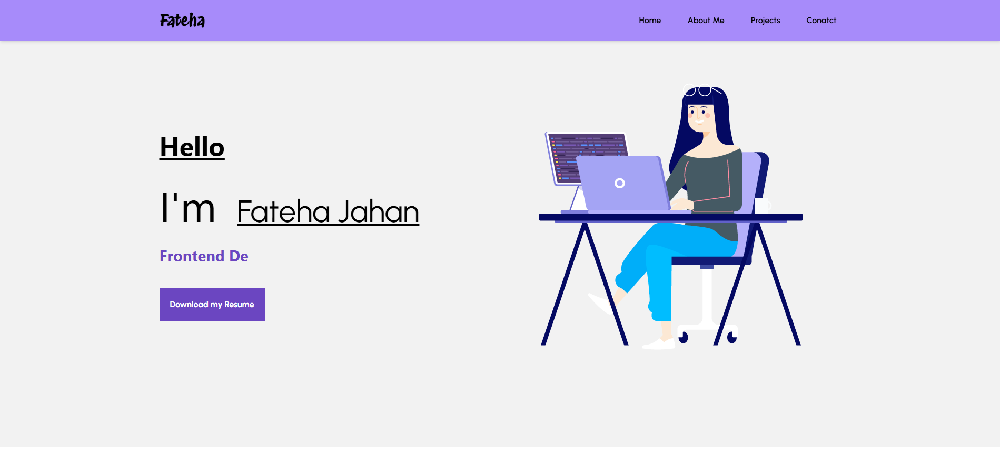

# 💼 Personal Portfolio Website

Welcome to my personal portfolio website built using **React**, **Tailwind CSS**, **JavaScript**, and **HTML**. This project showcases my work, skills, and the technologies I’m passionate about as a frontend developer.
## 🚀 Live Demo

[Click here to visit the live site](https://fateha-jahan.vercel.app/)

## 📌 Features

- **Single Page Application (SPA)** using **React Router DOM**
- Responsive design with **Tailwind CSS**
- **EmailJS** integration for direct email functionality via the contact form
- Reusable **layout components** for consistent structure across pages
- Fully functional navigation and routing between:
  - Home
  - About
  - Projects
  - Contact

## 🛠️ Technologies Used

| Technology      | Purpose                                      |
|-----------------|----------------------------------------------|
| React           | Frontend JavaScript library for UI building  |
| Tailwind CSS    | Utility-first CSS framework for styling      |
| React Router DOM| SPA routing and navigation                   |
| EmailJS         | Sending emails directly from the contact form|
| JavaScript      | Dynamic functionality                        |
| HTML            | Page structure and markup                    |

## 🔗 Navigation

Navigation between pages is handled using **React Router DOM**. A **Layout** component is used to encapsulate the **Navbar**, ensuring it is displayed consistently across all pages.

---

## 📬 Contact Form with EmailJS

The contact form on the **Contact** page is powered by **EmailJS**, allowing users to send messages directly to my inbox without needing a backend service.

---

## 📷 Screenshots

Currently, two official plugins are available:

- [@vitejs/plugin-react](https://github.com/vitejs/vite-plugin-react/blob/main/packages/plugin-react/README.md) uses [Babel](https://babeljs.io/) for Fast Refresh
- [@vitejs/plugin-react-swc](https://github.com/vitejs/vite-plugin-react-swc) uses [SWC](https://swc.rs/) for Fast Refresh
